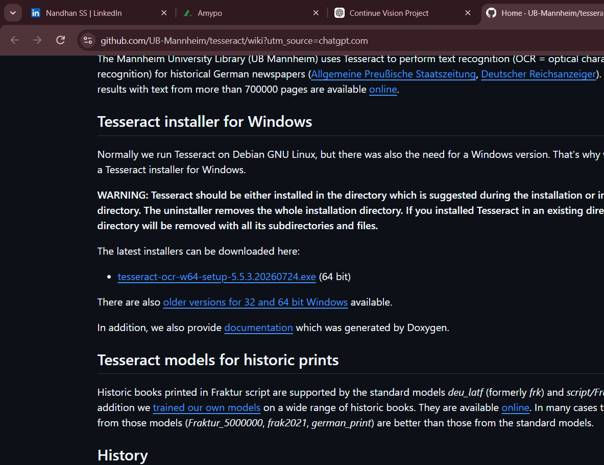

# NANDVISION

### Multimodal AI Intelligence Workspace



NANDVISION is an AI-powered multimodal workspace that combines computer vision, document intelligence, optical character recognition, and Retrieval-Augmented Generation (RAG) into a single interactive application.

It enables users to analyze images, ask questions about visual content, detect objects, extract text, process PDF documents, and retrieve context-based answers from uploaded files.

---

## Project Overview

NANDVISION was developed as a practical AI project to explore the integration of vision-language models, computer vision, OCR, document processing, semantic search, and language-model-based question answering.

The application brings multiple AI capabilities together through an interactive Streamlit interface.

---

## Features

### Image Intelligence

- **Image Q&A** — Ask questions about images using a Vision-Language Model.
- **Image Understanding** — Generate descriptions and interpret visual content.
- **Object Detection** — Detect and visualize objects using YOLO.
- **OCR** — Extract readable text from images using Tesseract OCR.

### Document Intelligence

- Convert PDF pages into images.
- Extract text from documents using OCR.
- Process multi-page PDF documents.
- Split document content into searchable chunks.
- Generate embeddings using Sentence Transformers.
- Perform semantic search using FAISS.
- Generate context-based answers using a language model.

---

## Technology Stack

| Technology | Purpose |
|---|---|
| Python | Core programming language |
| Streamlit | Interactive web interface |
| PyTorch | Deep learning framework |
| Transformers | Vision and language models |
| SmolVLM | Image understanding |
| YOLO | Object detection |
| OpenCV | Image processing |
| Tesseract OCR | Text extraction |
| Sentence Transformers | Text embeddings |
| FAISS | Vector similarity search |
| PyMuPDF | PDF processing |

---

## Project Architecture

```text
NANDVISION/
│
├── app.py
├── requirements.txt
├── packages.txt
├── README.md
├── .gitignore
│
├── assets/
│   ├── app-preview.png
│   ├── detected.jpg
│   ├── document_page.png
│   ├── document_page_1.png
│   ├── test.jpg
│   └── testocr.png
│
└── src/
    ├── __init__.py
    ├── vlm.py
    ├── detector.py
    ├── ocr.py
    ├── document.py
    ├── document_ai.py
    └── rag.py
```

---

## Installation

### 1. Clone the repository

```bash
git clone https://github.com/nandhan2307-blip/NandVision.git
```

### 2. Navigate to the project

```bash
cd NandVision
```

### 3. Create a virtual environment

```bash
python -m venv venv
```

### 4. Activate the virtual environment

**Windows PowerShell:**

```powershell
venv\Scripts\activate
```

### 5. Install dependencies

```bash
python -m pip install -r requirements.txt
```

---

## Run the Application

Start the Streamlit application:

```bash
streamlit run app.py
```

Open the local URL displayed in your terminal.

---

## Application Workflow

### Image Processing

```text
Upload Image
     ↓
Select AI Capability
     ↓
VLM / YOLO / OCR
     ↓
Process Input
     ↓
Display Results
```

### Document Question Answering

```text
Upload PDF
     ↓
Convert PDF Pages to Images
     ↓
Extract Text Using OCR
     ↓
Create Document Chunks
     ↓
Generate Embeddings
     ↓
Build FAISS Index
     ↓
Retrieve Relevant Context
     ↓
Generate Grounded Answer
```

---

## Retrieval-Augmented Generation

NANDVISION uses a Retrieval-Augmented Generation (RAG) pipeline to retrieve relevant information from uploaded documents.

The system:

1. Extracts text from PDF pages.
2. Divides the extracted text into manageable chunks.
3. Converts chunks into numerical embeddings.
4. Stores embeddings in a FAISS index.
5. Searches for relevant information based on the user's question.
6. Generates an answer using the retrieved document context.

This approach helps the application generate answers based on information contained in the uploaded document.

---

## Key Contributions

- Developed image understanding and visual question-answering workflows using Vision-Language Models.
- Integrated YOLO for object detection and Tesseract OCR for text extraction.
- Built a document processing pipeline for multi-page PDF analysis.
- Implemented semantic document retrieval using Sentence Transformers and FAISS.
- Integrated language-model-based answer generation using retrieved document context.
- Developed an interactive interface using Streamlit.
- Deployed the application using Streamlit Community Cloud.

---

## Project Goals

- Build practical experience in computer vision.
- Understand vision-language models.
- Implement document processing pipelines.
- Explore semantic search and Retrieval-Augmented Generation.
- Develop an interactive AI application.
- Create a portfolio-ready multimodal AI project.

---

## Future Improvements

- Improve document layout and table extraction.
- Add support for additional document formats.
- Improve answer evaluation and source citations.
- Add persistent knowledge-base storage.
- Optimize model performance and memory usage.
- Improve accessibility and user experience.
- Expand multimodal AI capabilities.

---

## Developer

**Nandhan S S**

Computer Science Engineering Student

Interested in Artificial Intelligence, Computer Vision, Development, and Cybersecurity.

---

## Project Status

**Deployed | Active Development**

NANDVISION is a practical portfolio project focused on multimodal AI, computer vision, and document intelligence.

Future development will focus on improving performance, retrieval accuracy, document processing, and user experience.